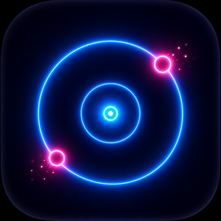
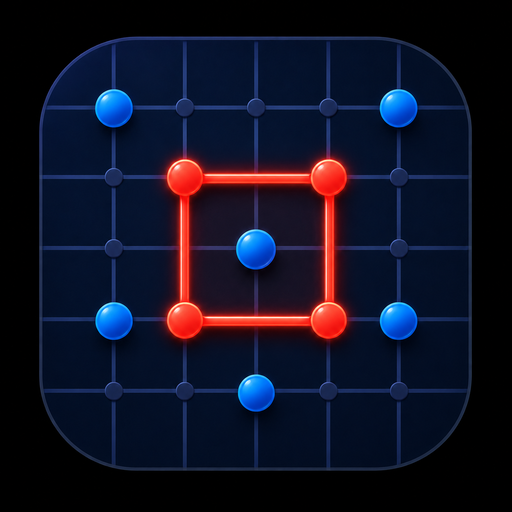
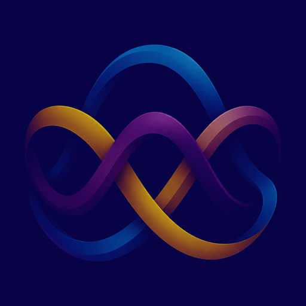
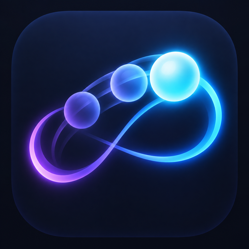
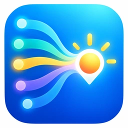

  
  <h1>Stanley Lloyd</h1>
  
<strong>Apps & Games</strong>

  
Focused software. Games with ideas.

  
<strong>Language</strong>

  

    
    &nbsp;&nbsp;
    
  

  

    <a href="https://stanleyll0yd.github.io/">Website</a>
    ·
    <a href="./SECURITY.md">Security</a>
  

---

I build compact products with clear interfaces, deliberate mechanics and as little unnecessary complexity as possible.

## Released products

| | Product | Platform | Focus |
|---|---|---|---|
|  | **[IMPULSE](https://stanleyll0yd.github.io/apps/impulse/)** | Android | Original one-tap chain-reaction game |
|  | **[Infinite Five](https://stanleyll0yd.github.io/apps/infinite-five/)** | Web / Native | Five in a row on an effectively infinite board |
|  | **[Dots](https://stanleyll0yd.github.io/apps/dots/)** | Web / Native | Stable cross-platform classic territory game with a shared Rust core |
|  | **[Password Generator](https://stanleyll0yd.github.io/apps/password-generator/)** | Android | Offline password generation and strength analysis |
|  | **[My Cycle](https://stanleyll0yd.github.io/apps/my-cycle/)** | Android | Private local-first cycle diary with explainable estimates and local reporting |
|  | **[Biorhythms](https://stanleyll0yd.github.io/apps/biorhythms/)** | Android | Classic cycles, interactive chart and widget |
|  | **[Everon](https://stanleyll0yd.github.io/apps/everon/)** | Windows x64 | Lightweight keep-awake tray utility |

## In development

| | Project | Platform | Status |
|---|---|---|---|
|  | **[RERUNA](https://github.com/StanleyLl0yd/reruna)** | Android / Kotlin / Compose | R1 pre-alpha |
|  | **[MeteoOne](https://github.com/StanleyLl0yd/meteoone)** | Android / Kotlin / Compose | M1 forecast core |
| **kenato** | **[Kenato](https://github.com/StanleyLl0yd/kenato)** | Android / Kotlin / Compose / WebRTC | M1 complete · pre-M2 |
|  | **AutoBook** | Android / Flutter | Active development |
|  | **DiskUsage** | macOS / SwiftUI | Source-only distribution |
|  | **What Fits?** | Android | Prototype |
|  | **WatchRelay** | Android / Android TV | MVP development |

## Product principles

- **Clear purpose** — each product solves a focused problem.
- **Local-first where possible** — data stays on the device unless a feature genuinely requires otherwise.
- **Minimal runtime dependencies** — fewer moving parts, less unnecessary complexity.
- **Public product pages** — the portfolio remains available even when source repositories are private.

## About this site

The portfolio is a dependency-light static site built with HTML, CSS and vanilla JavaScript. Product artwork is stored locally in this repository, so the public site does not depend on application source repositories remaining public.

Security is treated as part of the product surface: the `main` branch is protected and PR-only, changes pass a dedicated static security audit and CodeQL analysis, and secret scanning with push protection is enabled for the repository.

For vulnerability reporting and security details, see **[SECURITY.md](./SECURITY.md)**.

---

  
<strong>Русская версия</strong>

  

  Stanley Lloyd · Apps & Games · EN / RU

