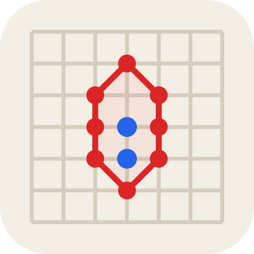
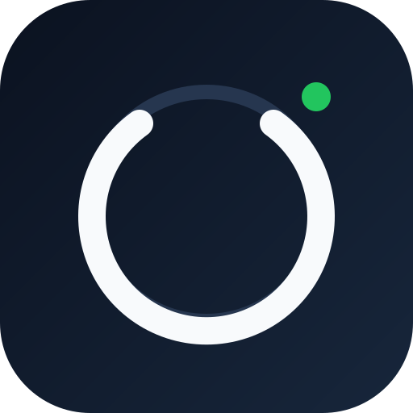
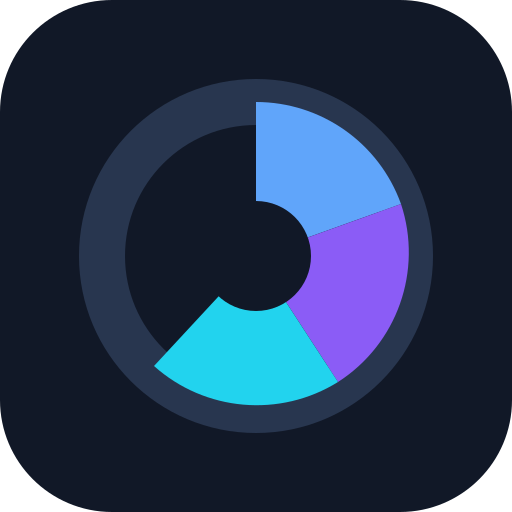

  
  <h1>Stanley Lloyd</h1>
  
<strong>Apps & Games</strong>

  
Продуманные приложения. Игры с характером.

  
<strong>Язык</strong>

  

    
    &nbsp;&nbsp;
    
  

  

    <a href="https://stanleyll0yd.github.io/">Сайт</a>
    ·
    <a href="./SECURITY.md">Безопасность</a>
  

---

Я делаю компактные продукты с понятным интерфейсом, продуманной механикой и минимумом лишней сложности.

## Готовые продукты

| | Продукт | Платформа | Назначение |
|---|---|---|---|
|  | **[IMPULSE](https://stanleyll0yd.github.io/apps/impulse/)** | Android | Авторская игра о цепной реакции, управляемая одним касанием |
|  | **[Infinite Five](https://stanleyll0yd.github.io/apps/infinite-five/)** | Web / Native | Пять в ряд на практически бесконечном поле |
|  | **[Точки](https://stanleyll0yd.github.io/apps/dots/)** | Web / Native | Цифровая версия классической игры на захват территории |
|  | **[Password Generator](https://stanleyll0yd.github.io/apps/password-generator/)** | Android | Офлайн-генерация паролей и оценка их стойкости |
|  | **[My Cycle](https://stanleyll0yd.github.io/apps/my-cycle/)** | Android | Приватный локальный дневник цикла |
|  | **[Biorhythms](https://stanleyll0yd.github.io/apps/biorhythms/)** | Android | Классические биоритмы, интерактивный график и виджет |
|  | **[Everon](https://stanleyll0yd.github.io/apps/everon/)** | Windows x64 | Лёгкая tray-утилита для предотвращения автоматического сна |

## В разработке

| | Проект | Платформа | Статус |
|---|---|---|---|
|  | **AutoBook** | Android / Flutter | Активная разработка |
|  | **DiskUsage** | macOS / SwiftUI | Предварительная версия |
|  | **What Fits?** | Android | Прототип |
|  | **WatchRelay** | Android / Android TV | Разработка MVP |

## Принципы продуктов

- **Понятная задача** — каждый продукт решает конкретную проблему.
- **Локальная работа с данными там, где это возможно** — данные остаются на устройстве, если функция действительно не требует иного.
- **Минимум runtime-зависимостей** — меньше лишних компонентов и ненужной сложности.
- **Публичные страницы продуктов** — витрина остаётся доступной независимо от того, открыты ли исходные репозитории приложений.

## Об этом сайте

Портфолио — лёгкий статический сайт на HTML, CSS и vanilla JavaScript без тяжёлых зависимостей. Графика продуктов хранится локально в этом репозитории, поэтому публичный сайт не зависит от того, остаются ли исходные репозитории приложений открытыми.

Безопасность рассматривается как часть самого продукта: ветка `main` защищена и принимает изменения только через PR, изменения проходят отдельный статический security-аудит и CodeQL, а для репозитория включены Secret Scanning и Push Protection.

Для сообщений об уязвимостях и подробностей по безопасности см. **[SECURITY.md](./SECURITY.md)**.

---

  
<strong>English version</strong>

  

  Stanley Lloyd · Apps & Games · EN / RU

